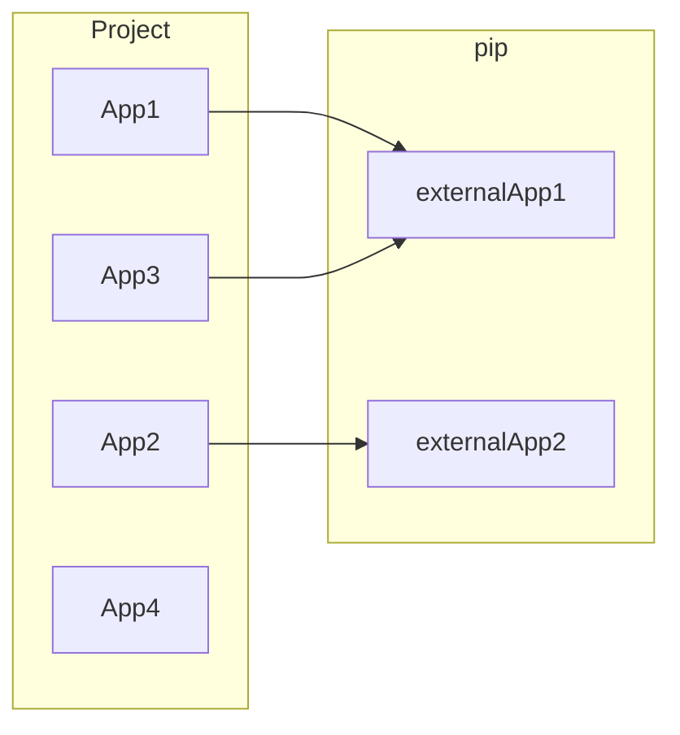

# Proyecto Desarrollo Software Basado en Plataformas


## 1. Sobre la asignatura

### 1.1 Descripcion General

En este curso los estudiantes deben aplicar un proceso de ingeniería de software,
incluyendo: ingeniería de requisitos, gestión de calidad, diseño y construcción de software;
para resolver un problema específico de un cliente.

La solución desarrollada en el curso contará de tres componentes principales:
1. **Backend:** como capa de acceso a datos de la aplicación. Se utilizará lenguajes como
Node.js, PHP, Python o Java junto con un repositorio de datos (base de datos
relacional o NoSQL).
2. **Frontend web:** aplicación web con tecnología HTML, CSS y JavaScript.
3. **Servicios Cloud:** Implementaicon de servicios basados en la nube como Firebase o AWS.

### 1.2 Resultado de aprendizaje

1. Concebir un producto de software que da solución a las necesidades planteadas por un
cliente.
2. Diseñar un producto de software utilizando UML considerando: diseño de alto nivel,
arquitectura del sistema e interfaz de usuario.
3. Implementar un producto de software de calidad, en base a buenas prácticas
recomendadas por los modelos de procesos, incluyendo una componente web y una
aplicación móvil.

### 1.3 Unidades tematicas

1. **Desarrollo basado en plataforma versus desarrollo tradicional**
    * Visión general de plataformas: web, móviles, industriales, etc.
    * Programación vía API específicas a las diferentes plataformas.
    * Visión general de lenguajes para plataformas: Python, Javascript, HTML5, Typescript, etc.
    * Programación bajo restricciones de la plataforma: número de núcleos, memoria, etc.
2. **Plataformas Web**
    * Lenguajes de programación Web modernos: HTML5, Javascript, NodeJS.
    * Arquitecturas de desarrollo web: Server side, AJAX, Single-Page.
    * Restricciones de la plataforma: memoria, número de usuarios, espacio, etc.
    * Estándares Web: HTML5, Web semántica, JSON.
    * Herramientas de desarrollo Web: Visual Studio Code, GIT, ThunderClient.
    * Servidores Web: Apache HTTP, Nginx, NodeJS.
    * Plataforma como servicio (PaaS): Digital Ocean, Amazon AWS, Google Apps.

### 1.4 Planificación general clase a clase

|Actividad                               | Fecha       |
| :--                                    | :---        |
| Introducción                           | 23 de marzo |
| How to write good code                 | 25 de marzo |
| Web Development                        | 30 de marzo |
| API Rest                               | 01 de abril |
| Databases SQL , NOSQL , ORM            | 06 de abril |
| CLI && GIT - gitflow                   | 08 de abril |
| Entorno de trabajo                     | 13 de abril |
| Backends w/ Django                     | 27 de abril |
| Backends w/ Django                     | 29 de abril |
| Backends w/ Django                     | 04 de mayo  |
| Backends w/ Django                     | 06 de mayo  |
| Frontends w/ Svelte                    | 11 de mayo  |
| Frontends w/ Svelte                    | 12 de mayo  |
| Cloud services w/Firebase              | 25 de mayo  |
| Docker                                 | 27 de mayo  |

### 1.5  Planificación de evaluaciones
|Evaluación                              | Fecha       |
| :--                                    | :---        |
| Entrega Analisis                       | 09 de junio |
| Avance de desarrollo grupal 1          | 17 de junio |
| Avance de desarrollo grupal 2          | 24 de junio |
| Avance de desarrollo grupal 3          | 01 de julio |
| Cátedra                                | 29 de junio |
| Revisión Final                         | 08 de julio  |

### 1.6 Distribucion de porcentajes

* Evaluaciones:
    1. Catedra ---> **10%**
	2. Trabajo Personal ---> **20%**
	3. Evaluacion Grupal por integrante ---> **30%**
	4. Proceso de desarrollo del proyecto (grupal) ---> **40%**
	    1. Informe ---> **30%**
		2. Promedio de avances ---> **20%**
		3. Evaluacion de codigo ---> **50%**

**Catedra:**
> Prueba con alternativas en el cual se evaluaran los conceptos involucrados en el proceso del desarrollo, practicamente el contenido de las diapositivas junto a informacion de otras fuentes como Clean Code.

**Trabajo Personal:**
> Revision de commits y PR's (Pull Request) solicitados semanalmente en funcion de lo que se vea en clase.

**Evaluacion grupal por integrante:**
> Cada integrante de equipo debera responder una pauta en la cual evaluara a sus compañeros(as) sobre si cumplio su labor en distintos ambitos. Esta evaluacion servira para hacer una diferencia entre la evaluacion grupal y asegurar un trabajo en equipo lo mas equitativo posible.

**Proceso de desarrollo del proyecto**

**Analisis:**
> Documento en formato Markdown (el mismo de este documento) que tendra como contenido todo el analisis del enunciado entregado junto a una propuesta de diseño con la planificacion o distribucion de tareas en base a casos de uso.

**Promedio de avances:**
> Promedio de las notas de cada presentacion de avance en funcion de la rubrica que se entregara una semana antes del inicio de estas.

**Evaluacion del codigo:**
> Similar al promedio de avances pero esto es en funcion de los pull request de cada proyecto, se revisara el estado del repositorio cada ciertas fechas y se esperan tener resultados implementados en donde se evaluara: buenas practicas, cumplir con la fecha y la meta solicitada (cumplir con lo que se solicito)


### 1.7 Formas de contacto

Email ---> german.rojo@ce.ucn.cl

Discord  ---> https://discord.gg/w3p8VrrS (se ira actualizando semanalmente)

El servidor de discord se utilizara para resolver todo tipo de consultas respecto al curso, la idea principal es mejorar la fluidez para que ustedes puedan avanzar en su desarrollo y tener una mejor orientacion.

Al igual que los correos electronicos, les respondere en la brevedad a cualquier hora del dia generalmente considerando el horario de oficina normal.

## 2. Primeros pasos :beginner:


Dentro de esta seccion encontraremos diversas configuraciones respecto a los sistemas, herramientas, librerias y frameworks que utilizaremos.


### 2.1 Entorno de trabajo :japanese_castle:

En este semestre trabajaremos con un enfoque hacia sistemas basados en UNIX (Linux / MacOs), por lo que recomiendo las siguientes opciones de trabajo:

* **Para usuarios Windows:** 

  Instalar el subsistema de linux, llamado Windows Subsystem Linux (WSL), esta caracteristica permite tener diversas distribuciones de linux instaladas en un equipo con sistema Windows de manera rapida y eficiente, esto es solamente a nivel de terminal no abarca interfaz grafica (que es lo unico que necesitamos). 

  Les adjunto una guia bastante completa de instalacion y uso:

  https://www.sitepoint.com/wsl2/

* **Para usuarios Linux:**

  Libertad de usar la distribucion que mas les acomode, pero recomendacion es mantener la sencillez y optar por distribuciones mucho mas consolidadas como Ubuntu o Fedora.

* **Para usuarios MacOs:**

  Utilizar lo nativo del sistema, recomendacion utilizar iTerm2 como consola.

A pesar de esto, no hay ningun problema si deciden trabajar en Windows pero el enfoque del curso estara orientado a los sistemas mencionados, de todas formas se incluira informacion e instrucciones para Windows en el semestre. Sin embargo, es imporante que sumen experiencia en sistemas UNIX ya que son plataformas mucho mas "dev-friendly".


### 2.2 Tecnologias a utilizar 📚

En esta instancia utilizaremos una arquitectura mas orientada a microservicios, en la cual desarrollaremos las capas por separado y en distintos lenguajes con el objetivo de poder experimentar una integracion de distintas plataformas y asi conocer el proceso de desarrollo web de forma  mas en detalle. Ademas, en Ingenieria de software ya tuvieron experiencia con una arquitectura monolitica (Laravel).  

Aca pueden leer mas sobre este tema  --> [Monolithic architecture vs Microservices](https://clockwise.software/blog/monolithic-architecture-vs-microservices-comparison/)

En general, dentro del semestre conoceremos estas tecnologias:

* Django

  * [Sitio oficial](https://docs.djangoproject.com/en/4.0/intro/install/)
  * [Guia y explicacion de Django REST Framework](https://opensource.com/article/18/8/django-framework) **Abarca casi todo lo que veremos**
  * [Documentacion de Django REST Framework](https://www.django-rest-framework.org/#)

* Svelte

  * [Sitio oficial](https://svelte.dev/docs)
  * [Introduccion a Svelte por Mozilla](https://developer.mozilla.org/en-US/docs/Learn/Tools_and_testing/Client-side_JavaScript_frameworks/Svelte_getting_started)
  * [Pequeña introduccion](https://blog.openreplay.com/a-practical-introduction-to-svelte)

* FIrebase

  * [Documentacion](https://firebase.google.com/docs/build) -> Conocer los servicios de autentificacion **(Authentication)** y almacenamiento **(Firestore)**.

* GIT

  * [Sitio Oficial]()

  * [Sobre HubFlow]()

    

### 2.3 Terminales :scroll:

Las terminales son parte fundamental del trabajo diario de un desarrollador, es necesario conocer la terminal de nuestro sistema, conocer las operaciones basicas y navegar a traves de ella. Todo lo que se hace mediante la interfaz pasa por la terminal y cuando mejoramos nuestra terminal podemos ser muuuy productivos. A continuacion les dejo algunas herramientas que mejoran el uso de terminal:

* [ohmyZsh](https://ohmyz.sh/)
  * [zsh-autosuggestions](https://github.com/zsh-users/zsh-autosuggestions) --> auto-completa nuestros comandos.
  * [zsh-syntax-highlighting](zsh-syntax-highlighting) --> sintaxis de la consola resalta commandos 
  * [Starship](https://starship.rs/guide/#%F0%9F%9A%80-installation) --> tema con un monton de caracteristicas nuevas para tu terminal.
    * alternativa : [powerlevel10k](https://github.com/romkatv/powerlevel10k) ambas son muy buenas, elige tu preferido


Estas herramientas son completamente opcional, el proceso de desarrollo no se vera comprometido del todo. Pero nos dan una experiencia completamente nueva y mucho mas friendly :thumbsup:


## 3. Trabajo personal :desktop_computer::bust_in_silhouette:

----

Aca podras encontrar la guia de trabajo paso a paso correspondiente a las semanas de induccion de Backend y Frontend, donde veremos el detalle de instalacion, configuracion del proyecto, comandos involucrados, estructura del proyecto, etc.

En esta version del curso, realizaremos una **API REST** basado en Django especificamente utilizando [Django REST Framework](https://www.django-rest-framework.org/#) en la cual veremos como crear los `models`, `managers`, `serializers`, `views`, `routes` y `responses` para un servicio API. Por otro lado, tendremos una aplicacion de frontend desarrollada en Svelte la cual consumira una api de terceros y asi trabajaremos en como renderizar esos datos.

Ambas capas se prueban y testean por separado, la integracion de ambas sera un desafio para el trabajo grupal. 

Todos los avances realizados en clases se veran reflejados en el siguiente repositorio:

* [Repositorio ProyectoDesarrolloSoftware 2022](https://github.com/garojar/proyectoDesarrolloSoftware2022)

Les recomiendo seguir el repositorio (:eye:) y añadirlo a sus favoritos (:star:) para llevar un seguimiento a traves de GitHub.  

### 3.1  Preparando Django :snake:

Primero debemos asegurarnos de tener instalado Python 3.x en nuestro sistema:

```bash
python3 --version
pip3 --version
```

En UNIX ya deben encontrar con una version de Python 3.x

Una vez nos aseguremos de tener `Python` y `pip` (package installer for Python)

```shell
python3 -m pip install Django
```


Nos posicionamos dentro del directorio que queramos inicializar nuestro proyecto y ejecutamos:

```shell
django-admin startproject personalProject
```

Se creara un directorio segun el nombre que utilizamos en este caso personalProject el cual sera nuestra aplicacion Django. 
Si inspeccionamos el contenido podemos ver lo  siguiente ( `ls -l personalProject`):

```
personalProject/
    manage.py
    personalProject/
        __init__.py
        settings.py
        urls.py
        asgi.py
        wsgi.py
```


* **<div style="display: inline">manage.py</div>** : Nos permite interactuar con Django en varias formas.
* **<div style="display: inline">urls.py</div>** : Rutas de la aplicacion
* **<div style="display: inline">settings.py</div>** : Configuracion del proyecto de Django
* **<div style="display: inline">wsgi.py</div>** : Entrada para web servers compatible con WSGI
* **<div style="display: inline">asgi.py</div>** : Entrada para web servers compatible con ASGI

Levantamos nuestro proyecto Django con el siguiente:

```bash
python3 manage.py runserver
```

Mostrando el siguiente mensaje:

```bash
Watching for file changes with StatReloader
Performing system checks...

System check identified no issues (0 silenced).

You have 18 unapplied migration(s). Your project may not work properly until you apply the migrations for app(s): admin, auth, contenttypes, sessions.                                                                                                                        
Run 'python manage.py migrate' to apply them.
April 24, 2022 - 21:43:59
Django version 4.0.4, using settings 'personalProject.settings'
Starting development server at http://127.0.0.1:8000/
Quit the server with CONTROL-C.
```


Felicidades ya hemos instalado nuestro proyecto Django con exito :raised_hands: :confetti_ball:

#### 3.1.1 Implementando Django REST Framework (DRF) :page_facing_up::satellite:

Django Rest Framework es una herramienta que nos va a facilitar el desarrollo de APIs para nuestra web.
Esto nos permitirá, acceder/modificar/eliminar datos del servidor desde una aplicación móvil, por ejemplo.

Primero descargamos DRF desde pip:

```
pip install djangorestframework
```

Ademas debemos instalar los siguientes paquetes:

```bash
pip install markdown       # soporte markdown para la API en el navegador
pip install django-filter  # soporte para filtrar 
```

y asi tenemos instalado DRF en nuestro sistema :white_check_mark:

Ahora debemos agregar DRF a nuestro proyecto Django , para esto debemos inspeccionar el archivo `settings.py`:

```python
INSTALLED_APPS = [
    'django.contrib.admin',
    'django.contrib.auth',
    'django.contrib.contenttypes',
    'django.contrib.sessions',
    'django.contrib.messages',
    'django.contrib.staticfiles',
    'rest_framework', # ------------->  añadimos esta linea 
]
```

DRF cuenta con una capa de presentacion para los endpoints (Browsable API) que vamos a construir, para incluir esta caractersitica debemos añadir en nuestras `routes` ( `urls.py` ) lo siguiente:

```python
urlpatterns = [
    ... # esto significa que posiblemente existan mas lineas
        # se utiliza para omitir el contenido a modo de ejemplo
    path('api-auth/', include('rest_framework.urls')),
]
```

Levantamos el proyecto para corroborar que todo este ok :white_check_mark:

```bash
python3 manage.py runserver
```

Si vemos el mensaje de que nuestro proyecto esta escuchando el puerto 8000 significa que todo esta bien.

#### 3.1.2 Creando una App en Django

En la filosofia de Django tenemos dos conceptos claves:

* **app**: Es una aplicacion web que abarca un dominio en especifico, esta compuesta por un conjunto de modelos, vistas, templates, test, etc.
* **project**: Es un conjunto de apps junto a la configuracion en si de estas. En otras palabras, un projecto puede estar compuesto de muchas apps o simplemente de una sola app.


En resumen:



Para el trabajo personal vamos a trabajar con solamente una app, para crear una app debemos utilizar:

```bash
django-admin startapp petclub
```

Vamos a crear una aplicacion que contendra datos de usuarios y sus mascotas. Al utilizar el commando `startapp` podemos ver que el directorio del projecto se actualizo quedando de la siguiente forma:

```bash
personalProject/
    manage.py
    petclub/      <--- app nueva
    	__init__.py
    	migrations/
    		__init__.py
    	admin.py
    	apps.py
    	models.py
    	tests.py
    	views.py
    personalProject/
        __init__.py
        settings.py
        urls.py
        asgi.py
        wsgi.py
```

Entonces, un pequeño resumen del contenido de una app:

- **migrations/**: Aca es donde Django almacena las migraciones de los modelos de esta aplicacion, las migraciones son archivos que contienen los cambios que se realizan en los **models**, la idea principal es mantener la sincronizacion de estos cambios para cualquier cambio de DB.
- **`admin.py`**: Aca se encuentra la configuracion para la app **Django Admin** (no la utilizaremos).
- **`apps.py`**: La configuracion de la app en si.
- **`models.py`**: Aca se almacenan las entidades relacionadas a esta aplicacion, se declaran como una clase de **Python** la cual hereda de la clase **Models** de Django y asi poder settear los atributos y funciones correspondientes.
- **`tests.py`**: Este archivo contiene los tests unitarios de la aplicacion.
- **`views.py`**: Aca es donde se encuentra todo el ciclo de request/response para la API.

Al igual que lo realizado con DRF, debemos incluir nuestra nueva `app`  en `settings.py`:

```python
INSTALLED_APPS = [
    'django.contrib.admin',
    'django.contrib.auth',
    'django.contrib.contenttypes',
    'django.contrib.sessions',
    'django.contrib.messages',
    'django.contrib.staticfiles',
    'rest_framework',
    'petclub',
]
```


#### 3.1.3 Creando modelos en Django :label::recycle:

La idea principal es que cada app tenga un dominio o una responsabilidad en especifico ( `SOLID - Single responsability`), comunmente podemos encontrarlos en el modulo `models.py` declarados de la siguiente forma:

```python
from django.db import models


class Person(models.Model):
    id = models.AutoField(primary_key=True)
    email = models.EmailField(max_length=255)
    first_name = models.CharField(max_length=50)
    last_name = models.CharField(max_length=50)
    rut = models.CharField(max_length=12)

    class Meta:
        managed = True

class Pet(models.Model):
    id = models.AutoField(primary_key=True)
   	species = models.CharField(max_length=50)
    name = models.CharField(max_length=50)
    age = models.IntegerField()
    color = models.CharField(max_length=50)

    class Meta:
        managed = True
```

Dependiendo del tamaño del proyecto y la escalabilidad de este es necesario cambiar la estructura del directorio de una app permitiendo gestionar los modelos de la siguiente forma:

```bash
petclub/
	...
	models/
		__init_.py
		person_models.py
		pet_models.py
	...
```

De esta manera se encapsulan los modelos en modulos que los relacionen entre si, pero para este caso (proyecto personal) no es necesario trabajar de esta forma. :dog2:

Vamos a crear los modelos `Person` y `Pet` que se utilizaron del ejemplo mas arriba :arrow_up::

```python
class Person(models.Model)

class Pet(models.Model)
```

Con esta definicion de las entidades debemos tener un registro de los cambios que hemos realizado en nuestros modelos, para esto utilizaremos el siguiente comando:

```
python3 manage.py makemigrations
```

`makemigrations` buscara en cada `app` por cambios no registrados en los modelos y creara automaticamente una migracion para definir estos cambios en la persistencia, mostrando un mensaje similar a este:

```sh
Migrations for 'petclub':
  petclub/migrations/0001_initial.py
    - Create model Person
    - Create model Pet
```

Creando un archivo en migrations con la siguiente notacion:

```
00x_nombremigracion.py

# x = numero de la migracion
```

Ya tenemos la receta para poder persistir estos cambios en nuestra base de datos, para el trabajo personal solo utilizaremos sqlite. Ahora debemos aplicar la migracion de esta forma:

```bash
python3 manage.py migrate
```

Desplegando lo siguiente:

```sh
Operations to perform:
  Apply all migrations: admin, auth, contenttypes, petclub, sessions
Running migrations:
  Applying contenttypes.0001_initial... OK
  Applying auth.0001_initial... OK
  Applying admin.0001_initial... OK
  Applying admin.0002_logentry_remove_auto_add... OK
  Applying admin.0003_logentry_add_action_flag_choices... OK
  Applying contenttypes.0002_remove_content_type_name... OK
  Applying auth.0002_alter_permission_name_max_length... OK
  Applying auth.0003_alter_user_email_max_length... OK
  Applying auth.0004_alter_user_username_opts... OK
  Applying auth.0005_alter_user_last_login_null... OK
  Applying auth.0006_require_contenttypes_0002... OK
  Applying auth.0007_alter_validators_add_error_messages... OK
  Applying auth.0008_alter_user_username_max_length... OK
  Applying auth.0009_alter_user_last_name_max_length... OK
  Applying auth.0010_alter_group_name_max_length... OK
  Applying auth.0011_update_proxy_permissions... OK
  Applying auth.0012_alter_user_first_name_max_length... OK
  Applying petclub.0001_initial... OK
  Applying sessions.0001_initial... OK
```


#### 3.1.4 Superuser :crown:

Django provee una gestion de usuarios muy completa, que por esta vez utilizaremos. Creamos un superusuario con el comando:

```bash
python3 manage.py createsuperuser
```

Aca en la consola nos solicitaran datos como **nombre**, **email** y **contraseña** para establecer un **super-usuario** en el projecto.


#### 3.1.5 Views :motor_scooter: :package:


Ahora que tenemos nuestros modelos, podemos crear `views` que actuaran como controladores de las `peticiones` que reciba nuestro `web service.`

Creamos una view que nos despliegue un hola mundo como ejemplo en `views.py`:

```python
# modulos de DRF
from rest_framework.response import Response
from rest_framework.views import APIView

class HelloWorld(APIView):
    def get(self, request): # verbo de la peticion como un metodo
        # logica asociada al endpoint
        return Response(data="Hello, World !", status=200) # respuesta del servicio
```

y en `urls.py` eliminamos el path del admin y añadimos nuestra view asi:

```python
from django.contrib import admin
from django.urls import path, include

from petclub.views import HelloWorld

urlpatterns = [
    path('hi', HelloWorld.as_view(), name="helloworld"),
    path('api-auth/', include('rest_framework.urls')),
]

```

Levantamos el proyecto y hacemos un curl a la url `localhost:8000/hi`:

```bash
curl localhost:8000/hi

> "Hello World"
```

Podemos utilizar las template de DRF para una vision mas humana :eyes:

```bash
localhost:8000/hi # en un navegador
```
### 3.2 Svelte

Como ya hemos visto Svelte se ejecuta en el momento de la compilación , convirtiendo sus componentes en un código imperativo altamente eficiente que actualiza quirúrgicamente el DOM. Como resultado, puedes crear aplicaciones con caracteristicas complejas de manera simple y muy eficientes.

Las caracteristicas principales son:
* es Reactivo.
* Sin virtual DOM, codigo js compilado.
* Less code.
* Basado en componentes.

### 3.2.1 Instalar Svelte


## 4. Trabajo grupal :desktop_computer::busts_in_silhouette:

Una vez definidos los grupos de este semestre se da comienzo a el **trabajo grupal de la asignatura**, cada grupo asigno los siguientes roles para al menos un integrante.

La asignacion de roles tiene como objetivo que cada integrante posea una **responsabilidad en especifico en el proyecto**, esto no lo limita a participar en otros roles.

1. Project Manager
2. Backend Developer
3. Frontend Developer
4. Quality Assurance

La idea principal es tener una experiencia de desarrollo lo mas similar a una de caracter profesional utilizando herramientas y practicas que **beneficiaran el crecimiento del estudiante.**

### 4.1. Grupos

Los grupos de este semestre son los siguientes:
|Centrabot|Project Manager|Backend Developer|FrontEnd Developer|Quality Assurance|
|:----|:----|:----|:----|:----|
|DIEGO CABEZAS LEYTON| | | |X|
|FABIAN SANABRIA AMPUERO|X| | | |
|CAMILO VALLADARES RUIZ| |X| | |
|DIEGO VERA SANTIS| | |X| |

|ChocoWork|Project Manager|Backend Developer|FrontEnd Developer|Quality Assurance|
|:----|:----|:----|:----|:----|
|NELSON SOTO SANCHEZ| | | |X|
|JUAN AVILA ARAYA|X| | | |
|MATIAS LEILA JARA| | |X| |
|MIGUEL GUTIERREZ ALVARADO| |X| | |

|Minskapp|Project Manager|Backend Developer|FrontEnd Developer|Quality Assurance|
|:----|:----|:----|:----|:----|
|YASMIN TALAMILLA ASTUDILLO| | | |X|
|IGNACIA RIVAS FIGUEROA| |X| | |
|YERKO PIZARRO ROMERO|X| | | |
|ROCÍO LABARCA CORONEL| | |X| |

|ITA Dono.Soft|Project Manager|Backend Developer|FrontEnd Developer|Quality Assurance|
|:----|:----|:----|:----|:----|
|JEREMY CAMUS VARELA| |X| | |
|HAYLIN PEREZ AYALA|X| | | |
|RODRIGO JIMENEZ GOMEZ| | |X| |
|JOSE RAMOS ZEPEDA| | | |X|

|<Nombre grupo>|Project Manager|Backend Developer|FrontEnd Developer|Quality Assurance|
|:----|:----|:----|:----|:----|
|HELMER PIZARRO SANDOVAL|X| | | |
|LUIS FELIPE CUBILLOS LEON| | | |X|
|WILSON ARAYA ORO| |X| | |
|RENE AVENDANO ZARATE| | |X| |
|ALEXA MUNOZ LEIVA| |X| | |
    
|OgresDev|Project Manager|Backend Developer|FrontEnd Developer|Quality Assurance|
|:----|:----|:----|:----|:----|
|NOAH FAUNDEZ VELASCO|X| | | |
|FELIPE AGUILERA CALDERON| | |X| |
|GABRIEL ESCUDERO PEREZ| |X| | |
|DIEGO VALENZUELA CABEZAS| | | |X|
    
|Jassh|Project Manager|Backend Developer|FrontEnd Developer|Quality Assurance|
|:----|:----|:----|:----|:----|
|ALLAN CORTES CORTES|X| | | |
|JHOAN MAMANI CARRILLO| |X| | |
|SCARLETT ZAPATA CORTES|X| | | |
|SEBASTIAN FUENTES BARRAZA| | | |X|
|HANS HENNINGS VERGARA| | |X| |


### 4.2 Enunciados para cada grupo
|Grupo            |Empresa           | 
|:----            |:----             |
|Jassh            |Aerolinea         |
|ITA Dono.Soft    |Recursos Humanos  |
|Minskapp         |Veterinaria       | 
|Centrabot        |Biblioteca Digital|
|OgresDev         |Hostal            |
|ChocoWork        |Banco             |
|Grupo Sin Nombre |Aerolinea         |
    

### 4.3. Entrega de Analisis y Diseño
    
Una vez tengan disponible el enunciado 
    

## 5. Consejos

En esta seccion dejare ciertos servicios, libros, tecnologias, canales, fuentes de todo tipo que considero que suman valor en el curriculum de un desarrollador. Tal vez no esten relacionadas al curso pero de igual forma les servira.

### 5.1. Daily Coding Problem

Es una servicio de suscripcion via email, el cual nos envia un problema relacionado a codigo a nuestra bandeja de entrada. Esto se caracteriza por que los problemas son realizados en entrevistas de trabajo de grandes empresas TI (Google, Netflix, Uber, etc).

La idea es crearse un habito de resolver estos problemas busca mejorar nuestra forma de programar y de estar preparados para proceso de seleccion en el area profesional.

Se los recomiendo, muy util para su crecimiento profesional :thumbsup: 

https://www.dailycodingproblem.com/

### 5.2. Hubflow

Hubflow es:
* Una extensión de **Git command-line tools**.
* Un fork de las herramientas originales de [Git-Flow](https://datasift.github.io/gitflow/GitFlowForGitHub.html).
* Comandos de una línea, para usar el modelo de ramificación GitFlow.
* Centrado en hacer el uso de Git Flow, lo más sencillo posible.

Las principales diferencias entre la herramienta original GitFlow y HubFlow son:

* Se automatizan tareas de push/pull según corresponda.
* Se agregaron comandos adicionales, (como la insercion y extraccion de funciones) Para completar algunos huecos que se dejaron con Git Flow.


#### 5.2.1. Instalar hubflow

Clonar el repositorio oficial.

```bash=
git clone https://github.com/datasift/gitflow
```

Ingresar a la carpeta con el proyecto clonado

```bash=
cd gitflow
```
Ejecutar la instalación

```bash=
sudo ./install.sh
```

#### 5.2.2. Crear un feature

Un feature es una característica nueva al sistema, hay que tener presente conceptos base de un feature.

* Un feature nace de la rama `develop`
* Un pull request del feature apunta **siempre** a develop.
* Un feature **no** modifica el `changelog.md` ni el archivo `VERSION`

Para crear un feature se deben ejecutar los siguientes comandos, **estando seguros que estamos en la rama develop**:

```bash=
git fetch

git hf update

git hf feature start nombre_del_feature
```
HubFlow creará la rama `feature/nombre_del_feature` en el local y en el remoto, además de posicionarnos automáticamente en la rama `feature/nombre_del_feature`.

Una vez que el pull request ha sido aceptado y mezclado en develop, debemos finalizar nuestro feature, para dejar paso a la creación del correspondiente release. 

Para finalizar el feature se debe ejecutar el siguiente comando estando seguros que estamos en la rama `feature/nombre_del_feature`.:

```bash=
git fetch
git hf update
git hf feature finish nombre_del_feature
```

Esto mezclará la rama en nuestro develop local y luego eliminará la rama en el local y en el remoto, dejándonos en la rama develop, listos para crear el correspondiente release.

#### 5.3. Crear un release

Un release, es una liberación de una nueva característica del sistema.

Un release:

* Nace de la aprobación de un feature.
* Cuando un feature se aprueba se mezcla a develop, es entonces que el release nace de develop, pero esta vez apuntamos a master, esto con el objetivo que el servidor de producción esté apuntando siempre a master, entonces bastará con hacer un `git pull` y consumirá lo que esté en la rama master. Permite un deploy muy limpio.
* El pull request se hace de la rama release a master. 
* Un release **si** modifica el archivo `changelog.md` y el archivo `VERSION`

Antes de crear el release nos fijamos en el archivo `VERSION`, para saber la cuenta del release.

```bash=
cat VERSION
``` 
esto podría arrojar el resultado: `21.0.0` en donde el primer par de números significan el año `2021` -> `21`, el próximo número quiere decir el número del release de ese año, en este caso hay un cero, por que no hay ningún release previo al año 17, el próximo numero corresponde al número de hotfix, en todo nuevo release este número se resetea a cero.

En resumen. Para el caso de:

`21.0.0`

* `21` -> año
* `0` -> Número de release de ese año.
* `0` -> Cantidad de hotfix de ese release (Este número vuelve a cero después de cada release).

Comandos para crear un release (estando en la rama develop):

```bash=
git fetch
git hf update
git hf release start numero_de_la_versión
```
esto creará en el local y remoto la rama `release/numero_de_la_versión` y posicionará el local automáticamente en dicha rama.

El release debe tener los siguientes cambios.

* El archivo `changelog.md`
* El archivo `VERSION`
* Todos los cambios que ya están aplicados de la mezcla del reciente feature.(estos ya vienen)

Ejemplo de la aplicación del la actualización de un `changelog.md`
```
## Release: 21.11.0
Monday 2021, Feb 4

* **Feature** [Add TIR images support by mark](https://github.com/godiecl/vamos/pull/21)

## Hotfix: 21.10.3
Monday 2021, Jan 15

* **Fix** [fix column spaces on PDF report ](https://github.com/godiecl/vamos/pull/24)

```
Se puede ver que los nuevos comentarios quedan con la estructura de una pila de datos. 

Se debe indicar el día y la fecha, ademas de una pequeña descripción de lo que se hizo, mas el link del Pull request del **feature** que dio vida a este release.

Una vez aprobado el Pull request, se debe dar fin al release.
```bash=
git fetch
git hf update
git hf release finish numero_de_release
```

>Nota: Recuerda siempre que el número de release es el numero que llevará el archivo VERSION cuando hagas el Pull request

## 6. Comandos utiles

```bash
# con django-admin
django-admin 
	- startapp <nombre_app> # Crea una nueva app
	- startproject <nombre_proyecto> # Crea un nuevo proyecto

# Con manage.py
python3 manage.py 
    - makemigrations # Crea migraciones
    - showmigrations # Ve las migraciones y su estado
    - migrate # Aplica las migraciones
    - createsuperuser # Crea un super-usuario

```
