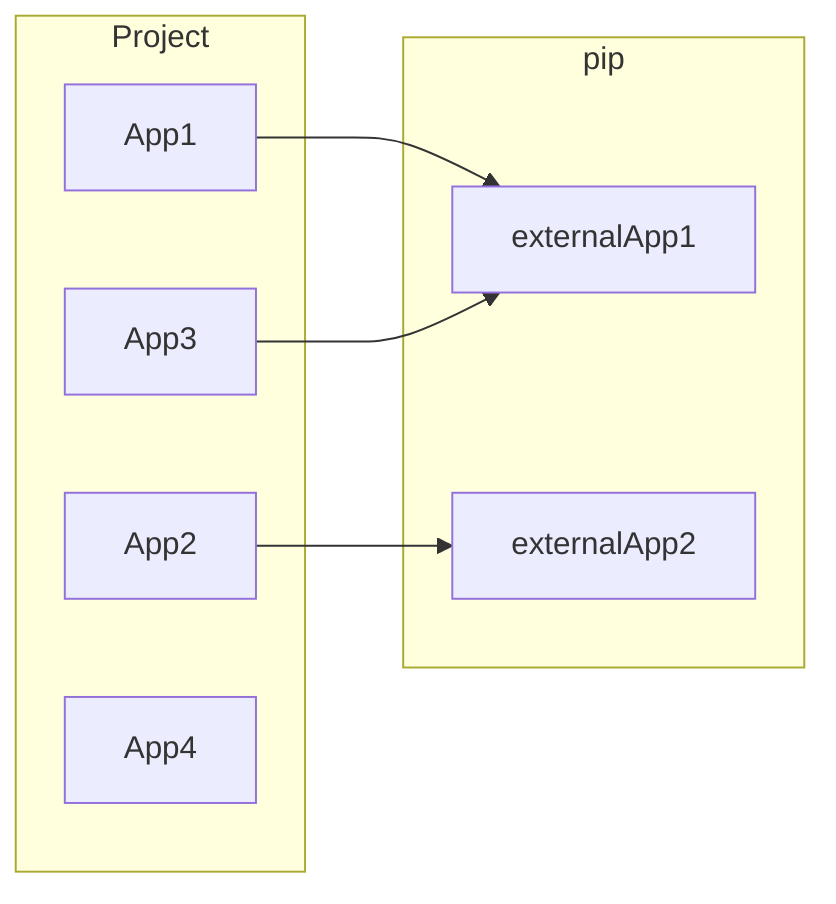

## Proyecto Desarrollo Software Basado en Plataformas


### 1. Primeros pasos :beginner:

---

Dentro de esta seccion encontraremos diversas configuraciones respecto a los sistemas, herramientas y op

#### 1.1 Entorno de trabajo :japanese_castle:

En este semestre trabajaremos con un enfoque hacia sistemas basados en UNIX (Linux / MacOs), por lo que recomiendo las siguientes opciones de trabajo:

* **Para usuarios Windows:** 

  Instalar el subsistema de linux, llamado Windows Subsystem Linux (WSL), esta caracteristica permite tener diversas distribuciones de linux instaladas en un equipo con sistema Windows de manera rapida y eficiente, esto es solamente a nivel de terminal no abarca interfaz grafica (que es lo unico que necesitamos). 

  Les adjunto una guia bastante completa de instalacion y uso:

  https://www.sitepoint.com/wsl2/

* **Para usuarios Linux:**

  Libertad de usar la distribucion que mas les acomode, pero recomendacion es mantener la sencillez y optar por distribuciones mucho mas consolidadas como Ubuntu o Fedora.

* **Para usuarios MacOs:**

  Utilizar lo nativo del sistema, recomendacion utilizar iTerm2 como consola.

A pesar de esto, no hay ningun problema si deciden trabajar en Windows pero el enfoque del curso estara orientado a los sistemas mencionados, de todas formas se incluira informacion e instrucciones para Windows en el semestre. Sin embargo, es imporante que sumen experiencia en sistemas UNIX ya que son plataformas mucho mas "dev-friendly".


#### 1.2 Tecnologias a utilizar 📚

En esta instancia utilizaremos una arquitectura mas orientada a microservicios, en la cual desarrollaremos las capas por separado y en distintos lenguajes con el objetivo de poder experimentar una integracion de distintas plataformas y asi conocer el proceso de desarrollo web de forma  mas en detalle. Ademas, en Ingenieria de software ya tuvieron experiencia con una arquitectura monolitica (Laravel).  

Aca pueden leer mas sobre este tema  --> [Monolithic architecture vs Microservices](https://clockwise.software/blog/monolithic-architecture-vs-microservices-comparison/)

En general, dentro del semestre conoceremos estas tecnologias:

* Django

  * [Sitio oficial](https://docs.djangoproject.com/en/4.0/intro/install/)
  * [Guia y explicacion de Django REST Framework](https://opensource.com/article/18/8/django-framework) **Abarca casi todo lo que veremos**
  * [Documentacion de Django REST Framework](https://www.django-rest-framework.org/#)

* Svelte

  * [Sitio oficial](https://svelte.dev/docs)
  * [Introduccion a Svelte por Mozilla](https://developer.mozilla.org/en-US/docs/Learn/Tools_and_testing/Client-side_JavaScript_frameworks/Svelte_getting_started)
  * [Pequeña introduccion](https://blog.openreplay.com/a-practical-introduction-to-svelte)

* FIrebase

  * [Documentacion](https://firebase.google.com/docs/build) -> Conocer los servicios de autentificacion **(Authentication)** y almacenamiento **(Firestore)**.

* GIT

  * [Sitio Oficial]()

  * [Sobre HubFlow]()

    

### 1.3 Terminales :scroll:

Las terminales son parte fundamental del trabajo diario de un desarrollador, es necesario conocer la terminal de nuestro sistema, conocer las operaciones basicas y navegar a traves de ella. Todo lo que se hace mediante la interfaz pasa por la terminal y cuando mejoramos nuestra terminal podemos ser muuuy productivos. A continuacion les dejo algunas herramientas que mejoran el uso de terminal:

* [ohmyZsh](https://ohmyz.sh/)
  * [zsh-autosuggestions](https://github.com/zsh-users/zsh-autosuggestions) --> auto-completa nuestros comandos.
  * [zsh-syntax-highlighting](zsh-syntax-highlighting) --> sintaxis de la consola resalta commandos 
  * [Starship](https://starship.rs/guide/#%F0%9F%9A%80-installation) --> tema con un monton de caracteristicas nuevas para tu terminal.
    * alternativa : [powerlevel10k](https://github.com/romkatv/powerlevel10k) ambas son muy buenas, elige tu preferido


Estas herramientas son completamente opcional, el proceso de desarrollo no se vera comprometido del todo. Pero nos dan una experiencia completamente nueva y mucho mas friendly :thumbsup:


### 2. Trabajo personal :desktop_computer::bust_in_silhouette:

----

Aca podras encontrar la guia de trabajo paso a paso correspondiente a las semanas de induccion de Backend y Frontend, donde veremos el detalle de instalacion, configuracion del proyecto, comandos involucrados, estructura del proyecto, etc.

En esta version del curso, realizaremos una **API REST** basado en Django especificamente utilizando [Django REST Framework](https://www.django-rest-framework.org/#) en la cual veremos como crear los `models`, `managers`, `serializers`, `views`, `routes` y `responses` para un servicio API. Por otro lado, tendremos una aplicacion de frontend desarrollada en Svelte la cual consumira una api de terceros y asi trabajaremos en como renderizar esos datos.

Ambas capas se prueban y testean por separado, la integracion de ambas sera un desafio para el trabajo grupal. 

#### 2.1  Preparando Django :snake:

Primero debemos asegurarnos de tener instalado Python 3.x en nuestro sistema:

```bash
python3 --version
pip3 --version
```

En UNIX ya deben encontrar con una version de Python 3.x

Una vez nos aseguremos de tener `Python` y `pip` (package installer for Python)

```shell
python3 -m pip install Django
```


Nos posicionamos dentro del directorio que queramos inicializar nuestro proyecto y ejecutamos:

```shell
django-admin startproject personalProject
```

Se creara un directorio segun el nombre que utilizamos en este caso personalProject el cual sera nuestra aplicacion Django. 
Si inspeccionamos el contenido podemos ver lo  siguiente ( `ls -l personalProject`):

```
personalProject/
    manage.py
    personalProject/
        __init__.py
        settings.py
        urls.py
        asgi.py
        wsgi.py
```


* **manage.py** : Nos permite interactuar con Django en varias formas.
* **urls.py**: Rutas de la aplicacion
* **settings.py**: Configuracion del proyecto de Django
* **wsgi.py**: Entrada para web servers compatible con WSGI
* **asgi.py**: Entrada para web servers compatible con ASGI

Levantamos nuestro proyecto Django con el siguiente:

```bash
python3 manage.py runserver
```

Mostrando el siguiente mensaje:

```bash
Watching for file changes with StatReloader
Performing system checks...

System check identified no issues (0 silenced).

You have 18 unapplied migration(s). Your project may not work properly until you apply the migrations for app(s): admin, auth, contenttypes, sessions.                                                                                                                        
Run 'python manage.py migrate' to apply them.
April 24, 2022 - 21:43:59
Django version 4.0.4, using settings 'personalProject.settings'
Starting development server at http://127.0.0.1:8000/
Quit the server with CONTROL-C.
```


Felicidades ya hemos instalado nuestro proyecto Django con exito :raised_hands: :confetti_ball:

#### 2.1.1 Implementando Django REST Framework (DRF) :page_facing_up::satellite:

Django Rest Framework es una herramienta que nos va a facilitar el desarrollo de APIs para nuestra web.
Esto nos permitirá, acceder/modificar/eliminar datos del servidor desde una aplicación móvil, por ejemplo.

Primero descargamos DRF desde pip:

```
pip install djangorestframework
```

Ademas debemos instalar los siguientes paquetes:

```bash
pip install markdown       # soporte markdown para la API en el navegador
pip install django-filter  # soporte para filtrar 
```

y asi tenemos instalado DRF en nuestro sistema :white_check_mark:

Ahora debemos agregar DRF a nuestro proyecto Django , para esto debemos inspeccionar el archivo `settings.py`:

```python
INSTALLED_APPS = [
    'django.contrib.admin',
    'django.contrib.auth',
    'django.contrib.contenttypes',
    'django.contrib.sessions',
    'django.contrib.messages',
    'django.contrib.staticfiles',
    'rest_framework', # ------------->  añadimos esta linea 
]
```

DRF cuenta con una capa de presentacion para los endpoints (Browsable API) que vamos a construir, para incluir esta caractersitica debemos añadir en nuestras `routes` ( `urls.py` ) lo siguiente:

```python
urlpatterns = [
    ...
    path('api-auth/', include('rest_framework.urls'))
]
```

Levantamos el proyecto para corroborar que todo este ok :white_check_mark:

```bash
python3 manage.py runserver
```

Si vemos el mensaje de que nuestro proyecto esta escuchando el puerto 8000 significa que todo esta bien.

#### 2.1.2 Creando una App en Django

En la filosofia de Django tenemos dos conceptos claves:

* **app**: Es una aplicacion web que abarca un dominio en especifico, esta compuesta por un conjunto de modelos, vistas, templates, test, etc.
* **project**: Es un conjunto de apps junto a la configuracion en si de estas. En otras palabras, un projecto puede estar compuesto de muchas apps o simplemente de una sola app.


En resumen:



Para el trabajo personal vamos a trabajar con solamente una app, para crear una app debemos utilizar:

```bash
django-admin startapp petclub
```

Vamos a crear una aplicacion que contendra datos de usuarios y sus mascotas. Al utilizar el commando `startapp` podemos ver que el directorio del projecto se actualizo quedando de la siguiente forma:

```bash
personalProject/
    manage.py
    petclub/      <--- app nueva
    	__init__.py
    	migrations/
    		__init__.py
    	admin.py
    	apps.py
    	models.py
    	tests.py
    	views.py
    personalProject/
        __init__.py
        settings.py
        urls.py
        asgi.py
        wsgi.py
```

Entonces, un pequeño resumen del contenido de una app:

- **migrations/**: Aca es donde Django almacena las migraciones de los modelos de esta aplicacion, las migraciones son archivos que contienen los cambios que se realizan en los **models**, la idea principal es mantener la sincronizacion de estos cambios para cualquier cambio de DB.
- **admin.py**: Aca se encuentra la configuracion para la app **Django Admin** (no la utilizaremos).
- **apps.py**: La configuracion de la app en si.
- **models.py**: Aca se almacenan las entidades relacionadas a esta aplicacion, se declaran como una clase de **Python** la cual hereda de la clase **Models** de Django y asi poder settear los atributos y funciones correspondientes.
- **tests.py**: Este archivo contiene los tests unitarios de la aplicacion.
- **views.py**: Aca es donde se encuentra todo el ciclo de request/response para la API.

Al igual que lo realizado con DRF, debemos incluir nuestra nueva `app`  en `settings.py`:

```python
INSTALLED_APPS = [
    'django.contrib.admin',
    'django.contrib.auth',
    'django.contrib.contenttypes',
    'django.contrib.sessions',
    'django.contrib.messages',
    'django.contrib.staticfiles',
    'rest_framework',
    'petclub',
]
```


#### 2.1.3 Creando modelos en Django :label::recycle:

La idea principal es que cada app tenga un dominio o una responsabilidad en especifico ( `SOLID - Single responsability`), comunmente podemos encontrarlos en el modulo `models.py` declarados de la siguiente forma:

```python
from django.db import models


class Person(models.Model):
    id = models.AutoField(primary_key=True)
    email = models.EmailField(max_length=255)
    first_name = models.CharField(max_length=50)
    last_name = models.CharField(max_length=50)
    rut = models.CharField(max_length=12)

    class Meta:
        managed = True

class Pet(models.Model):
    id = models.AutoField(primary_key=True)
   	species = models.CharField(max_length=50)
    name = models.CharField(max_length=50)
    age = models.IntegerField()
    color = models.CharField(max_length=50)

    class Meta:
        managed = True
```

Dependiendo del tamaño del proyecto y la escalabilidad de este es necesario cambiar la estructura del directorio de una app permitiendo gestionar los modelos de la siguiente forma:

```bash
petclub/
	...
	models/
		__init_.py
		person_models.py
		pet_models.py
	...
```

De esta manera se encapsulan los modelos en modulos que los relacionen entre si, pero para este caso (proyecto personal) no es necesario trabajar de esta forma. :dog2:

Vamos a crear los modelos `Person` y `Pet` que se utilizaron del ejemplo mas arriba :arrow_up::

```python
class Person(models.Model)

class Pet(models.Model)
```

Con esta definicion de las entidades debemos tener un registro de los cambios que hemos realizado en nuestros modelos, para esto utilizaremos el siguiente comando:

```
python3 manage.py makemigrations
```

`makemigrations` buscara en cada `app` por cambios no registrados en los modelos y creara automaticamente una migracion para definir estos cambios en la persistencia, mostrando un mensaje similar a este:

```sh
Migrations for 'petclub':
  petclub/migrations/0001_initial.py
    - Create model Person
    - Create model Pet
```

Creando un archivo en migrations con la siguiente notacion:

```
00x_nombremigracion.py

# x = numero de la migracion
```

Ya tenemos la receta para poder persistir estos cambios en nuestra base de datos, para el trabajo personal solo utilizaremos sqlite. Ahora debemos aplicar la migracion de esta forma:

```bash
python3 manage.py migrate
```

Desplegando lo siguiente:

```sh
Operations to perform:
  Apply all migrations: admin, auth, contenttypes, petclub, sessions
Running migrations:
  Applying contenttypes.0001_initial... OK
  Applying auth.0001_initial... OK
  Applying admin.0001_initial... OK
  Applying admin.0002_logentry_remove_auto_add... OK
  Applying admin.0003_logentry_add_action_flag_choices... OK
  Applying contenttypes.0002_remove_content_type_name... OK
  Applying auth.0002_alter_permission_name_max_length... OK
  Applying auth.0003_alter_user_email_max_length... OK
  Applying auth.0004_alter_user_username_opts... OK
  Applying auth.0005_alter_user_last_login_null... OK
  Applying auth.0006_require_contenttypes_0002... OK
  Applying auth.0007_alter_validators_add_error_messages... OK
  Applying auth.0008_alter_user_username_max_length... OK
  Applying auth.0009_alter_user_last_name_max_length... OK
  Applying auth.0010_alter_group_name_max_length... OK
  Applying auth.0011_update_proxy_permissions... OK
  Applying auth.0012_alter_user_first_name_max_length... OK
  Applying petclub.0001_initial... OK
  Applying sessions.0001_initial... OK
```


#### 2.1.4 Superuser :crown:

Django provee una gestion de usuarios muy completa, que por esta vez utilizaremos. Creamos un superusuario con el comando:

```bash
python3 manage.py createsuperuser
```

Aca en la consola nos solicitaran datos como **nombre**, **email** y **contraseña** para establecer un **super-usuario** en el projecto.


 ####  2.1.5 Views :motor_scooter: :package:


Ahora que tenemos nuestros modelos, podemos crear `views` que actuaran como controladores de las `peticiones` que reciba nuestro `web service.`

Creamos una view que nos despliegue un hola mundo como ejemplo en `views.py`:

```python
# modulos de DRF
from rest_framework.response import Response
from rest_framework.views import APIView

class HelloWorld(APIView):
    def get(self, request): # verbo de la peticion como un metodo
        # logica asociada al endpoint
        return Response(data="Hello, World !", status=200) # respuesta del servicio
```

y en `urls.py` eliminamos el path del admin y añadimos nuestra view asi:

```python
from django.contrib import admin
from django.urls import path, include

from petclub.views import HelloWorld

urlpatterns = [
    path('hi', HelloWorld.as_view(), name="helloworld"),
    path('api-auth/', include('rest_framework.urls')),
]

```

Levantamos el proyecto y hacemos un curl a la url `localhost:8000/hi`:

```bash
curl localhost:8000/hi

> "Hello World"
```

Podemos utilizar las template de DRF para una vision mas humana :eyes:

```bash
localhost:8000/hi # en un navegador
```


### 3. Trabajo grupal :desktop_computer::busts_in_silhouette:

> Not yet !


### 4. Comandos utiles

```bash
# con django-admin
django-admin 
	- startapp <nombre_app> # Crea una nueva app
	- startproject <nombre_proyecto> # Crea un nuevo proyecto

# Con manage.py
python3 manage.py 
    - makemigrations # Crea migraciones
    - showmigrations # Ve las migraciones y su estado
    - migrate # Aplica las migraciones
    - createsuperuser # Crea un super-usuario

```

